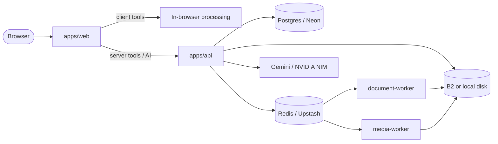
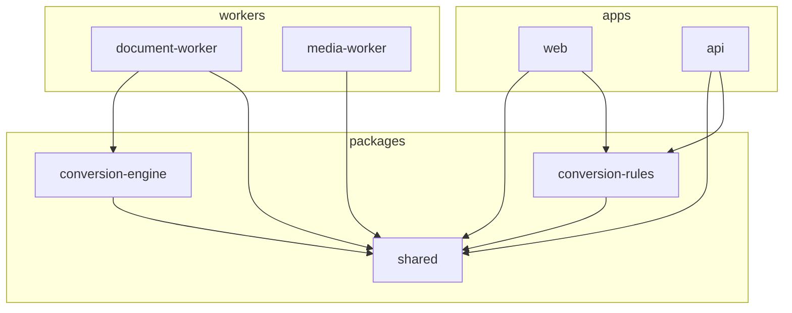
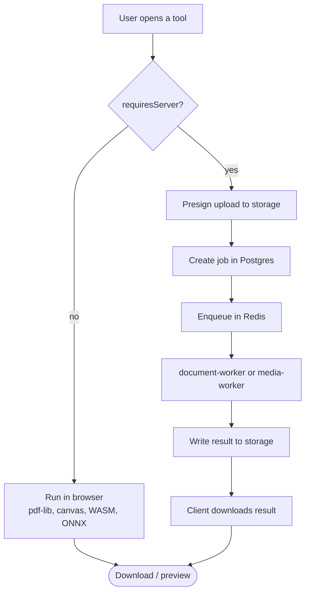

# Parivartan


Browser and server file tools for PDFs, images, office documents, video, and audio. Most image and PDF edits run in the browser. Office conversions and some media jobs run on the API and workers.

npm package names still use the `@convert-hub/*` scope from the original monorepo name.

## Overview

| Surface | Stack | Default port |
|---------|-------|--------------|
| Web app | Next.js 16, React 19, Tailwind CSS 4 | `5174` |
| API | Express 5, Postgres, Redis, S3-compatible storage | `8788` |
| Document worker | Node conversion engine + Chromium | queue consumer |
| Media worker | FFmpeg via BullMQ | queue consumer |



## Repository layout

```text
apps/
  web/                 Next.js UI, tool pages, client-side libraries
  api/                 Express API: uploads, jobs, AI routes
packages/
  shared/              Shared TypeScript types
  conversion-rules/    Tool registry and client vs server routing
  conversion-engine/   Node PDF / Office conversion helpers
workers/
  document-worker/     PDF and Office queue consumer
  media-worker/        FFmpeg queue consumer
infra/
  docker-compose.yml   Optional self-hosted Postgres / Redis reference
docs/
  under-construction.png
```



## How processing works

Tools declare capability in `packages/conversion-rules`. The UI uses that registry to decide whether work stays in the browser or goes through the API.



### Client-side (typical)

- PDF merge, split, compress, edit, watermark, rotate, protect, page numbers, JPG to PDF
- Most image tools: crop, resize, rotate, convert, compress, watermark, meme, photo editor, upscale, remove background, blur faces, HTML to image, PDF to JPG
- Audio merge (browser FFmpeg WASM where applicable)

### Server-side

- Office: PDF to Word / PowerPoint / Excel, Word to PDF
- Video: MP4 to WebM (client can prepare, server / worker completes when required)
- AI helpers: PDF summarize and translate extract text in the browser, then call `/api/ai` when keys are configured

Office layout fidelity is approximate. Scanned PDFs may use OCR, which is slower and less accurate than born-digital PDFs.

## Tools by category

| Category | Tools |
|----------|-------|
| PDF | Merge, Compress, Split, Edit, Watermark, Rotate, Protect, Page numbers, JPG to PDF, Summarize, Translate |
| Images | Compress, Resize, Crop, Convert to/from JPG, Photo editor, Upscale, Remove background, Watermark, Meme generator, Rotate, HTML to image, Blur faces, PDF to JPG |
| Office | PDF to Word, PDF to PowerPoint, PDF to Excel, Word to PDF |
| Video | MP4 to WebM |
| Audio | Merge audio |

Source of truth: `packages/conversion-rules/src/index.ts`.

## Prerequisites

- Node.js 20+
- npm 10+
- Postgres (Neon works well for local and hosted)
- Redis (Upstash works well for local and hosted)
- Object storage: Backblaze B2, or set `LOCAL_STORAGE_DIR` for disk-backed local uploads
- Chromium on the machine that runs `document-worker` (Word to PDF)
- Optional: `GEMINI_API_KEY` and/or `NVIDIA_NIM_API_KEY` for summarize / translate

Docker is not required for day-to-day development. See `infra/` if you prefer self-hosted Postgres or Redis.

## Getting started

```bash
npm install

npm run build --workspace=@convert-hub/shared
npm run build --workspace=@convert-hub/conversion-rules
npm run build --workspace=@convert-hub/conversion-engine

cp apps/api/.env.example apps/api/.env
# Optional worker env:
cp workers/document-worker/.env.example workers/document-worker/.env
```

Create `apps/web/.env.local` if you need to point the UI at a non-default API:

```bash
NEXT_PUBLIC_API_URL=http://localhost:8788
```

Fill `apps/api/.env` with `DATABASE_URL`, Redis, and storage settings, then:

```bash
npm run db:migrate --workspace=@convert-hub/api
npm run dev
```

In a second terminal when you need Office conversions:

```bash
npm run dev:worker
```

| URL | Purpose |
|-----|---------|
| http://localhost:5174 | Web UI |
| http://localhost:8788/health | API health |

## Environment

### API (`apps/api/.env`)

| Variable | Purpose |
|----------|---------|
| `PORT` | API port (default `8788`) |
| `WEB_ORIGIN` | CORS origin for the web app |
| `DATABASE_URL` | Postgres connection string |
| `UPSTASH_REDIS_URL` | Redis URL (`rediss://...` for Upstash) |
| `B2_KEY_ID` / `B2_APPLICATION_KEY` / `B2_BUCKET` / `B2_REGION` | Backblaze B2 |
| `LOCAL_STORAGE_DIR` | Prefer local disk over B2 when set |
| `GEMINI_API_KEY` / `NVIDIA_NIM_API_KEY` | Optional AI providers |

### Web (`apps/web/.env.local`)

| Variable | Purpose |
|----------|---------|
| `NEXT_PUBLIC_API_URL` | API base URL (default `http://localhost:8788`) |

### Document worker

Set `PUPPETEER_EXECUTABLE_PATH` if Chromium is not found automatically. Optional: `OCR_LANGUAGES` (for example `eng`).

## Scripts

| Command | Description |
|---------|-------------|
| `npm run dev` | Start web and API via Turborepo |
| `npm run dev:worker` | Start the document conversion worker |
| `npm run build` | Build packages and apps |
| `npm run typecheck` | Type-check workspaces |
| `npm run lint` | Lint workspaces |
| `npm run db:migrate --workspace=@convert-hub/api` | Apply SQL migrations |

## API surface

| Method | Path | Notes |
|--------|------|-------|
| `GET` | `/health` | Liveness |
| `POST` | `/api/uploads/presign` | Presigned upload URL |
| `*` | `/api/jobs` | Job create / status |
| `*` | `/api/ai` | Summarize / translate helpers |

Example presign:

```bash
curl -X POST http://localhost:8788/api/uploads/presign \
  -H "Content-Type: application/json" \
  -d '{"fileName":"doc.pdf","mimeType":"application/pdf","sizeBytes":1024}'
```

`PUT` the file bytes to the returned `uploadUrl` with the matching `Content-Type`.

## Storage

1. Create a B2 bucket and an application key with read, write, and delete on that bucket.
2. Set `B2_*` in `apps/api/.env`, or set `LOCAL_STORAGE_DIR=.local/storage` for local disk.
3. In B2, add lifecycle rules to expire `incoming/` and `outputs/` after 24 hours if you want automatic cleanup.

## Document worker

```bash
npm run dev:worker
```

Word to PDF needs a local Chromium binary:

- Linux: install `chromium` or `chromium-browser`, then set `PUPPETEER_EXECUTABLE_PATH` if needed
- Docker: `docker compose -f infra/docker-compose.yml up document-worker`

## Web app notes

- Locale support: English and Marathi (`apps/web/src/lib/i18n`)
- Category mega-menus on desktop, sheet menu on small screens
- Fixed meadow backdrop (`apps/web/public/meadow.jpg`) behind glass UI surfaces
- Tool routes live under `/tools/[toolId]`

## Development tips

1. Build shared packages after a clean clone before starting API or workers.
2. If cloud storage is unreachable, use `LOCAL_STORAGE_DIR` and confirm `/health` reports the storage backend you expect.
3. Client tools do not need Redis or B2. Server tools and AI routes do.
4. Keep `WEB_ORIGIN` aligned with the Next.js origin to avoid CORS failures.

## License

Private monorepo. Add a license file here if you publish or open the project.
